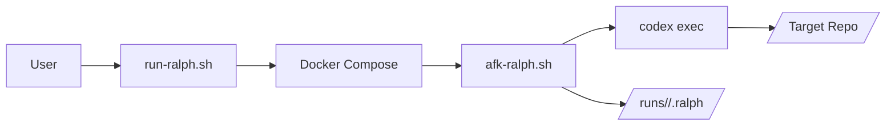

# Architecture

## 1. System Overview
- Purpose: Run Codex in a durable, repeatable loop against a target git repo using a living ExecPlan, with logs and audit-friendly commits.
- Primary goals: safety (plan-driven changes), durability (logs + plan state), and repeatability (deterministic scripts).
- Non-goals: providing a general CI system or replacing target-repo tooling.

Assumptions: The system is used locally with Docker installed and a target repository checked out on disk.

## 2. Architectural Style
- Style: Scripted orchestration with a containerized execution boundary.
- Rationale: Bash scripts are the simplest coordination layer for local workflows, and Docker isolates the Codex runtime from host dependencies.

## 3. Domain Model and Modules
- Runner: `run-ralph.sh` orchestrates a loop, mounts the target repo, and launches the container.
- Container entrypoint: `afk-ralph.sh` runs inside the container and invokes `codex exec` with the plan and schema.
- Setup/auth: `authenticate-codex.sh` and `docker/codex-setup.sh` build the image and install/authenticate the Codex CLI.
- Project initialization: `init-project.sh` seeds `.agent/PLANS.md` and `.agent/execplans/execplan.md` into a target repo.
- Shared helpers: `scripts/lib.sh` provides logging (including optional color), config parsing, path expansion, target repo resolution/validation (including `resolve_project_path`), and Docker helpers (including `docker_compose_checked`).
- Dependency preflight: `scripts/lib.sh` exposes `preflight_deps` to install JS dependencies in the target repo when needed.
- Templates/config: `templates/PLANS.md`, `ralph.config.toml`, and `ralph.schema.json` define plan rules, defaults, and output schema.

## 4. Directory Layout
- `docker/`: container setup scripts and Codex CLI setup.
- `scripts/`: shared helper library and preflight tooling.
- `templates/`: plan rules template copied into target repos.
- `runs/`: per-project logs and structured outputs.
- Root scripts: `run-ralph.sh`, `afk-ralph.sh`, `init-project.sh`, `authenticate-codex.sh`.

## 5. Data Flow and Boundaries
- Host flow: user runs `run-ralph.sh` -> reads `ralph.config.toml` -> validates Docker -> starts container.
- Container flow: `afk-ralph.sh` -> `codex exec` -> edits target repo mounted at `/work` -> writes logs and JSON output.
- Host-to-container handoff: when `afk-ralph.sh` is invoked outside Docker, it uses `docker_compose_checked run --rm` to launch the container with `RALPH_IN_DOCKER=1`, then re-enters `afk-ralph.sh` inside the container.
- Boundary: the target repo is mounted read/write; all code changes occur there, never in this runner repo.

## 6. Cross-Cutting Concerns
- Logging: standardized `log_info`, `log_warn`, `log_error`, `log_step`, and `log_success` in `scripts/lib.sh`, with optional ANSI color enabled via `RALPH_LOG_COLOR=1` when stdout is a TTY.
- Error handling: `set -euo pipefail` in scripts; fail fast on missing requirements via shared `require_file` helper (supports optional hints), and on invalid argument counts via `require_args`.
- Configuration: `ralph.config.toml` read via `read_config_value` (including `model_reasoning_effort`); path expansion handled inside `resolve_project_path`; target repo resolution via `resolve_project_path`.
- Caching: per-run caches under `runs/<project>/.ralph/` to reduce repeated installs.

## 7. Data and Integrations
- Docker and Docker Compose v2 for runtime isolation.
- Codex CLI installed via npm inside the container.
- Git required in the target repo to enforce plan-based changes and commits.
- Optional JS package managers in the target repo: npm, pnpm, yarn.

## 8. Deployment and Environments
- Execution is local via `docker compose`; no remote deploy target.
- Environment variables passed into the container define plan paths, log paths, and run directories.
- The host filesystem is mounted into the container at `/work` for the target repo and at `/workspace` for the runner repo.

## 9. Key Design Decisions
- Use Docker to keep Codex tooling isolated from host dependencies and ensure repeatability.
- Treat `.agent/execplans/execplan.md` in the target repo as the single source of truth for work.
- Centralize shared helpers in `scripts/lib.sh` to remove duplicate logic and keep behavior consistent.
- Keep logging helpers centralized and opt into color only for the long-running loop via `RALPH_LOG_COLOR`.
- Resolve and validate target repo paths through a single shared helper to prevent drift across host entrypoints.
- Centralize project path resolution in `resolve_project_path` to keep host entrypoints consistent.
- Centralize Docker Compose preflight via `docker_compose_checked`, passing explicit subcommands like `run --rm` or `build` to keep entrypoints consistent.

## 10. Diagrams (Mermaid)

## 11. Forbidden Patterns
- Reintroducing duplicate helper functions outside `scripts/lib.sh`.
- Modifying a target repo without a plan in `.agent/execplans/execplan.md`.
- Writing runner logs into the target repo.

## 12. Open Questions
- Should the runner support a non-Docker execution path for environments where Docker is unavailable?
